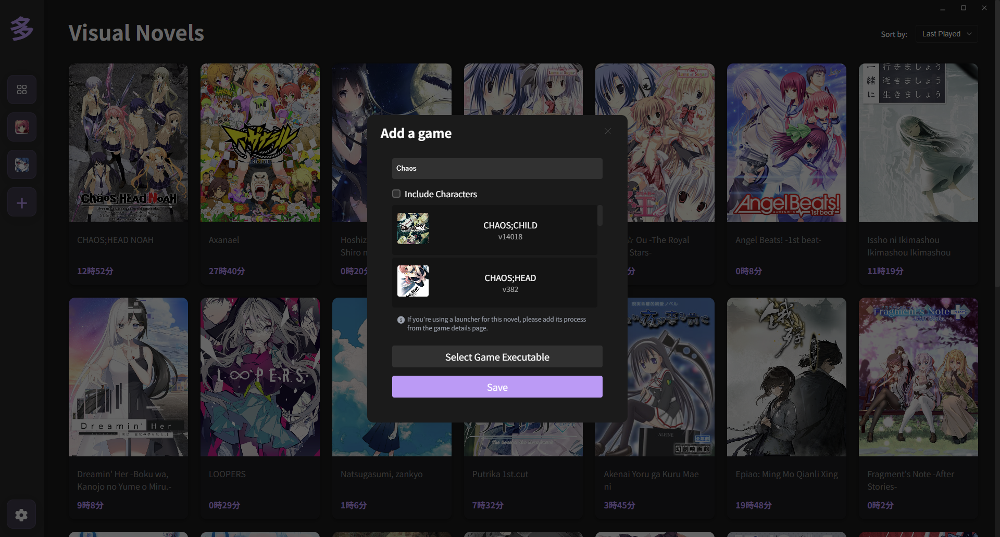
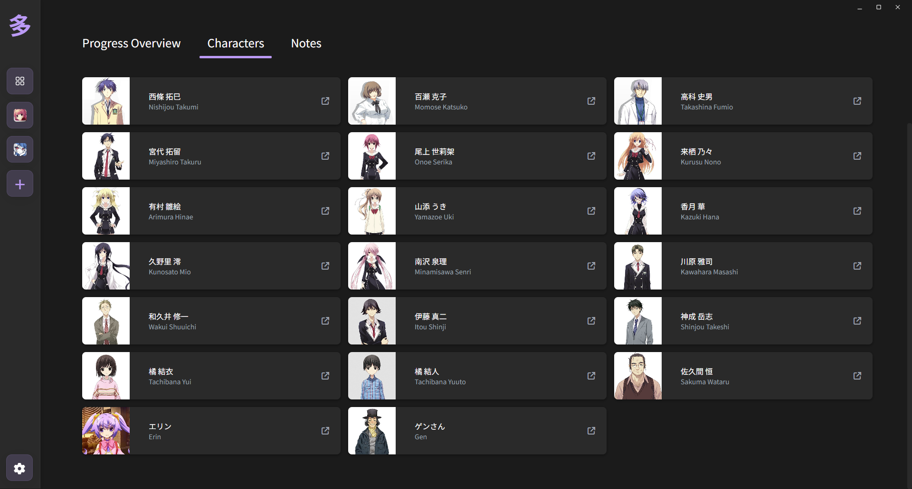

# Tadoku - Visual Novel Tracker

<p align="center">
  
</p>

<p align="center">
  <strong>A modern, blazing-fast Visual Novel tracker designed for Japanese learners and casual readers</strong>
</p>

<p align="center">
  
  
  
  
</p>

---

## Table of Contents

- [Overview](#overview)
- [Features](#features)
- [Installation](#installation)
  - [Prerequisites](#prerequisites)
  - [Download & Install](#download--install)
  - [Building from Source](#building-from-source)
- [Usage](#usage)
  - [Getting Started](#getting-started)
  - [Adding Visual Novels](#adding-visual-novels)
  - [Tracking Playtime](#tracking-playtime)
  - [Managing Your Library](#managing-your-library)
  - [Discord Integration](#discord-integration)
  - [ExStatic Integration](#exstatic-integration)
- [Configuration](#configuration)
- [Development](#development)
  - [Tech Stack](#tech-stack)
  - [Project Structure](#project-structure)
  - [Building](#building)
- [Contributing](#contributing)
- [Troubleshooting](#troubleshooting)
- [Screenshots](#screenshots)
- [Acknowledgments](#acknowledgments)
- [License](#license)
- [Support](#support)

---

## Overview

Tadoku is a comprehensive Visual Novel library management application that helps you organize, track, and manage your VN collection. Built with **Tauri** and **SvelteKit**, it provides a lightweight, cross-platform experience with an intuitive user interface.

Whether you're a Japanese language learner using visual novels for immersion or a casual reader who wants to keep track of your progress, Tadoku offers powerful features to enhance your reading experience.

### Key Highlights

- **Lightweight**: Built with Tauri for minimal system resource usage
- **Fast**: Blazing-fast performance with modern web technologies
- **Cross-platform**: Native support for Windows, with Linux compatibility
- **VNDB Integration**: Automatic game information retrieval from VNDB
- **Time Tracking**: Precise playtime monitoring with two tracking modes
- **Discord Rich Presence**: Share your current reading activity
- **Privacy-focused**: All data stored locally on your machine

---

## Features

### Core Features
- **Visual Novel Library Management**: Add, edit, and organize your VN collection
- **Automatic Playtime Tracking**: Monitor time spent reading each visual novel
- **VNDB API Integration**: Search and import game information from VNDB database
- **Game Launcher**: Launch games directly from the application
- **Progress Tracking**: Keep track of your reading progress and completion status

### Advanced Features
- **NSFW Content Filtering**: Built-in blur filter for NSFW images (configurable)
- **Pinned Games**: Quick access to your favorite or currently reading visual novels
- **Character Information**: Optional character tracking and information display
- **Discord Rich Presence**: Display current reading activity on Discord
- **ExStatic Integration**: Enhanced playtime accuracy for Japanese learning


### Platform Support
- **Windows**: Full native support with all features
- **Linux**: Basic support (requires building from source)
- **Cross-platform Data**: Portable configuration and database files

---

## Installation

### Prerequisites

For end users:
- Windows 10/11 (recommended) or Linux distribution
- Internet connection for VNDB integration (works offline after downloading games info)

For developers:
- **Rust**: Install from [rustup.rs](https://rustup.rs/)
- **Bun**: Install from [bun.sh](https://bun.sh/)
- **Node.js**: Version 18+ (if not using Bun)

### Download & Install

#### Windows
1. Visit the [Releases page](https://github.com/Eroge-Abyss/tadoku/releases)
2. Download the latest `.exe` installer
3. Run the installer and follow the setup wizard
4. Launch Tadoku from the Start menu or desktop shortcut

#### Linux
Currently, Linux users need to build from source. Pre-built binaries may be available in future releases.

### Building from Source

1. **Clone the repository**:
   ```bash
   git clone https://github.com/Eroge-Abyss/tadoku.git
   cd tadoku
   ```

2. **Install dependencies**:
   ```bash
   bun install
   ```

3. **Development build**:
   ```bash
   bun run tauri dev
   ```

4. **Production build**:
   ```bash
   bun run tauri build
   ```

---

## Usage

### Getting Started

1. **First Launch**: When you first open Tadoku, you'll see an empty library
2. **Add Your First Game**: Click the `+` button to add your first visual novel
3. **Configure Settings**: Access settings to customize tracking preferences and Discord integration

### Adding Visual Novels

1. **Click the Add Button**: Use the `+` button in the main interface
2. **Search VNDB**: Enter the game name or VNDB ID to search the database
3. **Select Game**: Choose the correct game from the search results
4. **Set Executable Path**: Browse and select the game's executable file
5. **Configure Options**: Set up character tracking and other preferences

### Tracking Playtime

Tadoku offers two playtime tracking modes:

- **Classic Tracking**: Monitors active game windows automatically
- **ExStatic Integration**: Enhanced accuracy for Japanese learners

**To start tracking**:
1. Launch a game from your library
2. Tadoku automatically detects when the game is running
3. View accumulated playtime in the game details

### Managing Your Library

- **Pin Games**: Right-click games to pin them for quick access
- **Filter Content**: Use NSFW filtering to blur sensitive content
- **Sort Options**: Sort by name, playtime, date added, or completion status

### Discord Integration

1. **Enable in Settings**: Turn on Discord Rich Presence
2. **Automatic Updates**: Your Discord status updates when playing games
3. **Privacy Control**: Toggle the feature on/off at any time

### ExStatic Integration

For Japanese learners using text hooker tools:

1. **Install ExStatic Fork**: Use the [custom Tadoku-compatible version](https://github.com/kofta999/exSTATic)
2. **Configure Settings**: Change playtime recording mode to ExStatic in Tadoku settings
3. **Enhanced Tracking**: Get more accurate playtime based on actual text reading

---

## Configuration

### Settings Location

- **Windows**: `C:\Users\{username}\AppData\Local\tadoku\`
- **Linux**: `/home/{username}/.local/share/tadoku/`

### Key Configuration Options

- **Playtime Tracking Mode**: Choose between automatic or ExStatic integration
- **Discord Rich Presence**: Enable/disable Discord integration
- **NSFW Filtering**: Configure content filtering preferences
- **Theming**: Choose between multiple built-in themes or use your custom color accent

---

## Development

### Tech Stack

**Frontend**:
- SvelteKit 2.x
- TypeScript
- Vite

**Backend**:
- Rust with Tauri 2.x
- VNDB API integration
- Discord Rich Presence SDK

**Build Tools**:
- Bun (package manager)
- Tauri CLI
- Rust toolchain

### Project Structure

```
tadoku/
├── src/                   # SvelteKit frontend
│   ├── lib/               # Shared components and utilities
│   ├── routes/            # Application pages
│   └── app.html           # HTML template
├── src-tauri/             # Rust backend
│   ├── src/               # Rust source code
│   ├── Cargo.toml         # Rust dependencies
│   └── tauri.conf.json    # Tauri configuration
├── static/                # Static assets
└── assets/                # Application assets and screenshots
```

### Building

**Development**:
```bash
bun run tauri dev
```

**Production**:
```bash
bun run tauri build
```

**Linting and Formatting**:
```bash
bun run format
bun run check
```

---

## Contributing

We welcome contributions from the community! Here's how you can help:

### Getting Started
1. Fork the repository
2. Create a feature branch: `git checkout -b feature-name`
3. Make your changes and test thoroughly
4. Submit a pull request with a detailed description

### Areas for Contribution
- Bug fixes and performance improvements
- New features and enhancements
- Documentation improvements
- Translation and localization
- Testing and QA

### Guidelines
- Follow the existing code style and conventions
- Update documentation as needed

---

## Troubleshooting

### Common Issues

**Game not launching**:
- Verify the executable path is correct
- Check file permissions
- Ensure the game is not already running

**Playtime not tracking**:
- Confirm classic mode tracking is enabled
- Check if the game process is being detected

**VNDB search not working**:
- Check internet connection
- Verify VNDB API is accessible
- Try searching with different keywords

### Log Files

Logs are stored in:
- **Windows**: `C:\Users\{username}\AppData\Local\tauri\logs`
- **Linux**: `/home/{username}/.local/share/tauri/logs`

**Easy Access**: You can quickly open the logs directory by using the "Open Logs Directory" button in the App Settings section of the application settings.

For detailed logging information, see the [Tauri Logging Documentation](https://tauri.app/plugin/logging/#persisting-logs).

### Debug Mode

For advanced debugging or to enable more verbose logging in release builds, you can activate debug mode using an environment variable.

Set the `TADOKU_DEBUG` environment variable to `1` or `true` before launching the application.

- **Linux/macOS:**
  ```bash
  TADOKU_DEBUG=1 ./path/to/tadoku
  ```
  Or to enable for your current shell session:
  ```bash
  export TADOKU_DEBUG=1
  ./path/to/tadoku
  ```
- **Windows (Command Prompt):**
  ```cmd
  set TADOKU_DEBUG=1
  ./path/to/tadoku.exe
  ```
- **Windows (PowerShell):**
  ```powershell
  $env:TADOKU_DEBUG="1"
  ./path/to/tadoku.exe
  ```

Remember to unset the environment variable if you no longer need debug mode (e.g., `unset TADOKU_DEBUG` on Linux/macOS or `set TADOKU_DEBUG=` on Windows CMD).

---

## Screenshots

### Main Library View

*Overview of your visual novel library with playtime tracking*

### Game Details Page

*Detailed information about individual games including characters and progress*

### Add Game Modal

*VNDB integration for easy game addition*

### Characters Page

*Character information and tracking (optional feature)*

---

## Acknowledgments

- **[Tauri](https://tauri.app/)**: For providing an excellent framework for building lightweight desktop applications
- **[VNDB](https://vndb.org/)**: For maintaining the comprehensive Visual Novel database and API
- **[SvelteKit](https://kit.svelte.dev/)**: For enabling fast and reactive frontend development

---

## License

This project is licensed under the MIT License. See the `LICENSE` file for details

---

## Support

### Getting Help

If you encounter issues or have questions:

1. **Check Documentation**: Review this README and troubleshooting section
2. **Search Issues**: Look through existing [GitHub Issues](https://github.com/Eroge-Abyss/tadoku/issues)
3. **Create New Issue**: Open a new issue with detailed information
4. **Include Logs**: Attach relevant log files when reporting bugs

### Bug Reports

When reporting bugs, please include:
- Operating system and version
- Tadoku version
- Steps to reproduce the issue
- Expected vs actual behavior
- Log files (if applicable)

### Feature Requests

We welcome suggestions for new features! Please:
- Check existing feature requests first
- Provide detailed use cases
- Explain the expected benefit to users

---

**Happy reading with Tadoku!**
